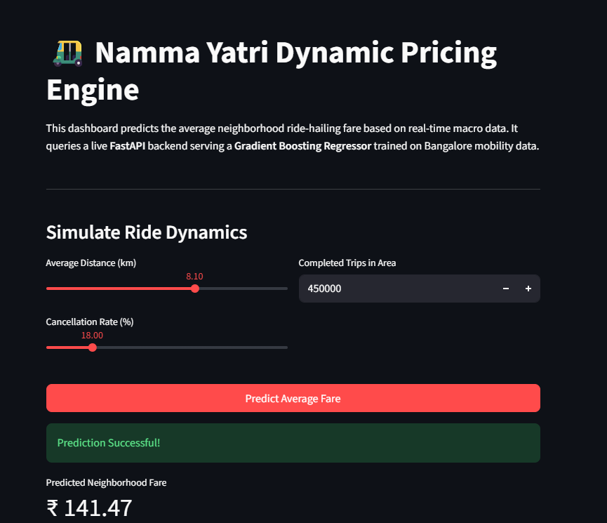

# 🛺 Namma Yatri Dynamic Pricing Engine & MLOps Pipeline

An end-to-end MLOps system that predicts average neighborhood ride-hailing fares using open-source mobility data from Bengaluru. The project takes a trained Scikit-learn model from experimentation all the way to a live, served production API with an interactive dashboard.



## Overview

The pipeline covers the full model lifecycle:
1. **Train & track** a Gradient Boosting Regressor on Bangalore mobility data, with experiments logged in MLflow
2. **Serve** the champion model behind a FastAPI inference endpoint
3. **Visualize & simulate** fare predictions through an interactive Streamlit dashboard

## Results

- **R² score:** 0.9699
- **RMSE:** ₹2.79
- **66% reduction** in computational overhead versus the baseline model, achieved through MLflow-tracked hyperparameter optimization
- **Sub-50ms inference latency** on the production API

## Tech Stack

- **Core:** Python, Pandas, Scikit-learn
- **MLOps & Tracking:** MLflow, SQLite
- **Deployment:** FastAPI (inference API), Streamlit (dashboard), Docker

## System Architecture

1. **Experimentation** — hyperparameters tracked using MLflow to identify the most optimized architecture
2. **Production API** — a FastAPI backend serves the champion model with sub-50ms inference latency, using Pydantic for input validation schemas
3. **User Dashboard** — a Streamlit UI lets users simulate ride parameters (distance, completed trips, cancellation rate) and get a live fare prediction from the API

## Project Structure

```
├── data/raw/              # Source mobility dataset (CSV)
├── models/                # Trained model artifact (pickled sklearn pipeline)
├── src/
│   ├── train_mlflow.py    # Model training + MLflow experiment tracking
│   ├── api.py              # FastAPI inference server
│   ├── app.py              # Streamlit dashboard
│   ├── Docker_file.api     # Dockerfile for the API service
│   └── Docker_file.app     # Dockerfile for the Streamlit service
├── docker-compose.yml      # Runs API + dashboard together
└── requirements.txt
```

## How to Run Locally

**1. Clone the repo**
```bash
git clone https://github.com/scariadon5/Namma-Yatri-Pricing-MLOPS-.git
cd Namma-Yatri-Pricing-MLOPS-
```

**2. Set up a virtual environment and install dependencies**
```bash
python -m venv .venv
source .venv/Scripts/activate   # Windows (Git Bash)
# source .venv/bin/activate      # macOS/Linux
pip install -r requirements.txt
```

**3. Start the FastAPI inference server**
```bash
uvicorn src.api:app --reload
```
Interactive API docs are available at http://127.0.0.1:8000/docs

**4. Launch the Streamlit dashboard**

In a new terminal (with the virtual environment active):
```bash
streamlit run src/app.py
```
The dashboard opens at http://localhost:8501. Adjust the sliders to send live payloads to the FastAPI backend and get an instant fare prediction.

### Run with Docker instead

```bash
docker-compose up --build
```
This spins up both the API (port 8000) and the dashboard (port 8501) together.

## License

This project is licensed under the MIT License — see the [LICENSE](./LICENSE) file for details.

---

Built by [Don Scaria](https://github.com/scariadon5)
